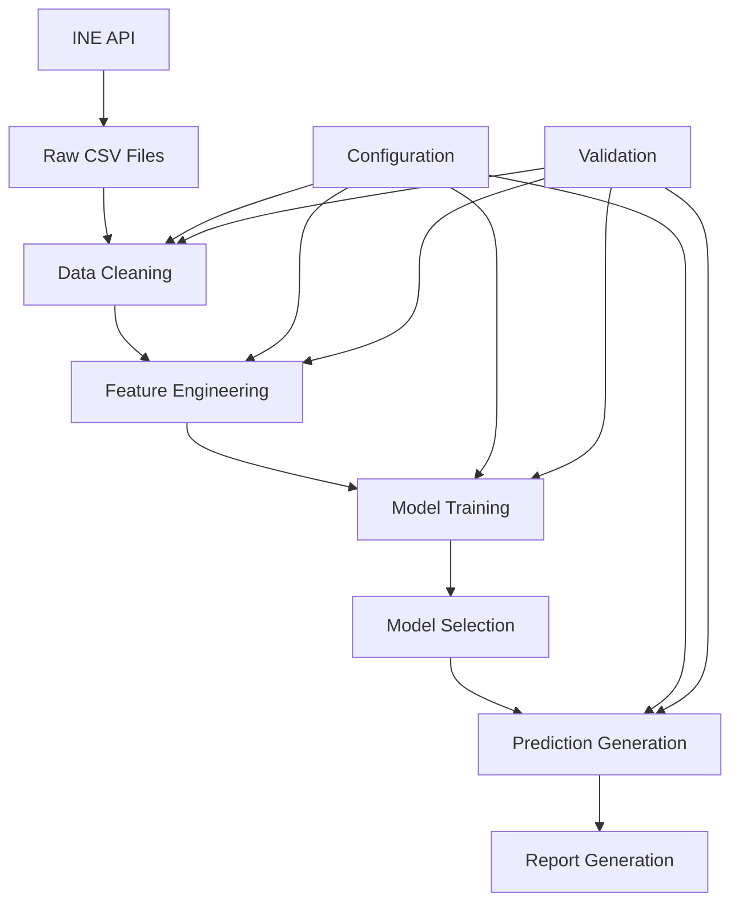

# Documentación Técnica Completa: Sistema de Predicción de Inflación

## Índice

1. [Arquitectura del Sistema](#arquitectura-del-sistema)
2. [Documentación de Módulos](#documentación-de-módulos)
3. [Flujo de Datos](#flujo-de-datos)
4. [Configuración y Parámetros](#configuración-y-parámetros)
5. [Procesos de Validación](#procesos-de-validación)
6. [Optimización y Rendimiento](#optimización-y-rendimiento)
7. [Mantenimiento y Actualizaciones](#mantenimiento-y-actualizaciones)

## Arquitectura del Sistema

### Diseño Modular

El sistema sigue un patrón de arquitectura modular con separación clara de responsabilidades:

```
┌─────────────────┐    ┌─────────────────┐    ┌─────────────────┐
│   Data Source   │    │   Processing    │    │     Output      │
│                 │    │                 │    │                 │
│ ┌─────────────┐ │    │ ┌─────────────┐ │    │ ┌─────────────┐ │
│ │ INE API     │ │───▶│ │ Data Clean  │ │───▶│ │ Predictions │ │
│ └─────────────┘ │    │ └─────────────┘ │    │ └─────────────┘ │
│                 │    │ ┌─────────────┐ │    │ ┌─────────────┐ │
│                 │    │ │ Feature Eng │ │    │ │ Reports     │ │
│                 │    │ └─────────────┘ │    │ └─────────────┘ │
│                 │    │ ┌─────────────┐ │    │ ┌─────────────┐ │
│                 │    │ │ ML Models   │ │    │ │ Visualiz.   │ │
│                 │    │ └─────────────┘ │    │ └─────────────┘ │
└─────────────────┘    └─────────────────┘    └─────────────────┘
```

### Principios de Diseño

- **Modularidad**: Cada componente tiene una responsabilidad específica
- **Configurabilidad**: Parámetros externalizados en archivos YAML
- **Robustez**: Manejo de errores y recuperación automática
- **Escalabilidad**: Diseño preparado para volúmenes de datos mayores
- **Mantenibilidad**: Código documentado y estructura clara

## Documentación de Módulos

### 1. INE Data Extractor (`ine_extractor.py`)

#### Propósito

Módulo responsable de la extracción automatizada de datos del Instituto Nacional de Estadística (INE) de España.

#### Funcionalidades Principales

```python
class INEExtractor:
    def __init__(self, config_path: str)
    def download_ipc_general(self, start_date: str, end_date: str) -> pd.DataFrame
    def download_ipc_groups(self, start_date: str, end_date: str) -> pd.DataFrame
    def download_ipca(self, start_date: str, end_date: str) -> pd.DataFrame
    def test_all_connections(self) -> Dict[str, bool]
    def export_all_data(self, start_date: str, end_date: str) -> Dict[str, str]
```

#### Características Técnicas

- **Protocolo**: HTTP/HTTPS con requests
- **Formato de Datos**: JSON desde API, conversión a CSV
- **Reintentos**: Lógica de backoff exponencial (3 intentos máximo)
- **Timeout**: 30 segundos por defecto
- **Validación**: Verificación de estructura de datos recibidos

#### Manejo de Errores

```python
# Tipos de errores manejados:
- ConnectionError: Problemas de conectividad
- TimeoutError: Timeout en requests
- JSONDecodeError: Respuesta malformada del INE
- ValidationError: Datos recibidos no válidos
```

#### Configuración

```yaml
data:
  urls:
    ipc_general: "https://servicios.ine.es/wstempus/js/ES/DATOS_TABLA/50902"
    ipc_groups: "https://servicios.ine.es/wstempus/js/ES/DATOS_TABLA/50904"
    ipca: "https://servicios.ine.es/wstempus/js/ES/DATOS_TABLA/25171"
  retry:
    max_attempts: 3
    backoff_factor: 2
    timeout: 30
```

### 2. Data Processor (`data_cleaner.py`)

#### Propósito

Limpieza, validación y preparación de datos para análisis posterior.

#### Funcionalidades Principales

```python
class DataProcessor:
    def load_raw_data(self, filepath: str) -> pd.DataFrame
    def handle_missing_values(self, data: pd.DataFrame) -> pd.DataFrame
    def detect_outliers(self, data: pd.DataFrame) -> List[int]
    def normalize_dates(self, data: pd.DataFrame) -> pd.DataFrame
    def calculate_inflation_rates(self, data: pd.DataFrame) -> pd.DataFrame
    def generate_statistics(self, data: pd.DataFrame) -> Dict
```

#### Técnicas de Limpieza

1. **Valores Faltantes**:

   - Interpolación lineal para gaps < 3 meses
   - Interpolación spline para gaps > 3 meses
   - Forward/backward fill para extremos de serie

2. **Detección de Outliers**:

   - Método IQR (Interquartile Range)
   - Z-score con umbral configurable (default: 3.0)
   - Análisis de residuos de tendencia

3. **Normalización de Fechas**:
   - Conversión a datetime estándar
   - Validación de secuencia temporal
   - Manejo de diferentes formatos de entrada

#### Cálculos Estadísticos

```python
# Métricas calculadas:
- Tasas de variación mensual: (Pt - Pt-1) / Pt-1 * 100
- Tasas de variación anual: (Pt - Pt-12) / Pt-12 * 100
- Estadísticas descriptivas: media, mediana, desviación estándar
- Tests de estacionariedad: ADF, KPSS
```

### 3. Feature Engineer (`feature_engineering.py`)

#### Propósito

Creación de características (features) para modelos de machine learning.

#### Funcionalidades Principales

```python
class FeatureEngineer:
    def create_lag_features(self, data: pd.DataFrame, lags: List[int]) -> pd.DataFrame
    def create_rolling_features(self, data: pd.DataFrame, windows: List[int]) -> pd.DataFrame
    def create_seasonal_features(self, data: pd.DataFrame) -> pd.DataFrame
    def create_economic_indicators(self, data: pd.DataFrame) -> pd.DataFrame
    def get_feature_summary(self, data: pd.DataFrame) -> Dict
```

#### Tipos de Características

1. **Lag Features**:

   - Valores históricos: t-1, t-3, t-6, t-12
   - Diferencias: Δt-1, Δt-3, Δt-6
   - Ratios: Rt/Rt-1, Rt/Rt-12

2. **Rolling Features**:

   - Medias móviles: 3, 6, 12 meses
   - Desviaciones estándar móviles
   - Mínimos y máximos móviles

3. **Seasonal Features**:

   - Componentes estacionales (Fourier)
   - Dummies mensuales
   - Tendencia lineal y cuadrática

4. **Economic Indicators**:
   - Momentum indicators
   - Volatilidad realizada
   - Índices de aceleración/desaceleración

#### Validación de Features

```python
# Checks realizados:
- Correlación excesiva (> 0.95)
- Varianza insuficiente (< 0.01)
- Valores infinitos o NaN
- Distribuciones anómalas
```

### 4. Model Trainer (`model_trainer.py`)

#### Propósito

Entrenamiento, evaluación y selección de modelos predictivos.

#### Modelos Implementados

##### ARIMA (AutoRegressive Integrated Moving Average)

```python
# Configuración automática:
- Grid search para parámetros (p,d,q)
- Criterio de selección: AIC/BIC
- Validación de residuos
- Tests de diagnóstico
```

##### Random Forest

```python
# Hiperparámetros:
- n_estimators: 100
- max_depth: 10
- min_samples_split: 5
- min_samples_leaf: 2
- Validación cruzada: 5-fold
```

##### LSTM (Long Short-Term Memory)

```python
# Arquitectura:
- Input layer: sequence_length x n_features
- LSTM layer: 50 hidden units, dropout 0.2
- Dense layer: 1 output unit
- Optimizer: Adam, learning_rate: 0.001
- Early stopping: patience=10
```

#### Métricas de Evaluación

```python
def calculate_metrics(y_true, y_pred):
    mae = mean_absolute_error(y_true, y_pred)
    rmse = sqrt(mean_squared_error(y_true, y_pred))
    mape = mean_absolute_percentage_error(y_true, y_pred)
    return {'MAE': mae, 'RMSE': rmse, 'MAPE': mape}
```

#### Selección de Modelo

```python
# Criterios de selección:
1. MAPE (peso: 40%)
2. RMSE (peso: 30%)
3. MAE (peso: 20%)
4. Estabilidad (peso: 10%)

# Score final = Σ(peso_i * (1 - métrica_normalizada_i))
```

### 5. Predictor (`predictor.py`)

#### Propósito

Generación de predicciones utilizando el modelo seleccionado.

#### Funcionalidades Principales

```python
class Predictor:
    def load_best_model(self, model_path: str) -> Dict
    def generate_predictions(self, horizon: int, input_data: pd.DataFrame = None) -> pd.DataFrame
    def calculate_confidence_intervals(self, predictions: pd.DataFrame) -> pd.DataFrame
    def validate_predictions(self, predictions: pd.DataFrame) -> Dict
    def export_predictions_csv(self, predictions: pd.DataFrame, filepath: str) -> str
    def export_predictions_json(self, predictions: pd.DataFrame, filepath: str) -> str
```

#### Cálculo de Intervalos de Confianza

```python
# Métodos implementados:
1. Bootstrap resampling (para Random Forest)
2. Residual analysis (para ARIMA)
3. Monte Carlo dropout (para LSTM)

# Nivel de confianza configurable (default: 95%)
```

#### Validación de Predicciones

```python
# Checks de validación:
- Rango razonable: [-5%, 10%] para inflación anual
- Continuidad: cambios graduales entre períodos
- Estacionalidad: patrones coherentes con histórico
- Tendencia: coherencia con contexto económico
```

### 6. Report Generator (`report_generator.py`)

#### Propósito

Generación de informes técnicos, visualizaciones y documentación.

#### Funcionalidades Principales

```python
class ReportGenerator:
    def create_visualizations(self, historical_data, predictions, evaluation_results) -> Dict
    def generate_economic_analysis(self, historical_data, predictions, evaluation_results) -> Dict
    def create_technical_report(self, analysis, visualizations, evaluation_results) -> str
    def export_code_screenshots(self) -> Dict
```

#### Visualizaciones Generadas

1. **Series Temporales**:

   - Inflación histórica vs predicciones
   - Componentes estacionales
   - Tendencias de largo plazo

2. **Análisis de Modelos**:

   - Comparación de métricas
   - Residuos y diagnósticos
   - Importancia de características

3. **Análisis Económico**:
   - Distribuciones de inflación
   - Análisis sectorial
   - Comparaciones internacionales

#### Generación de PDF

```python
# Librerías utilizadas:
- reportlab: Generación de PDF
- matplotlib: Gráficos
- seaborn: Visualizaciones estadísticas

# Estructura del informe:
1. Resumen ejecutivo
2. Metodología
3. Resultados
4. Análisis económico
5. Conclusiones y recomendaciones
```

## Flujo de Datos

### Pipeline Completo



### Formatos de Datos

#### Raw Data (INE)

```json
{
  "Nombre": "Índices nacionales: general y de grupos ECOICOP",
  "Data": [
    {
      "Anyo": 2024,
      "Periodo": "M01",
      "Valor": 117.123
    }
  ]
}
```

#### Processed Data

```csv
fecha,ipc_value,inflation_rate_monthly,inflation_rate_annual
2024-01-01,117.123,0.25,2.45
2024-02-01,117.456,0.28,2.52
```

#### Engineered Features

```csv
fecha,ipc_value,lag_1,lag_3,lag_6,lag_12,ma_3,ma_6,seasonal_component
2024-01-01,117.123,116.890,116.234,115.678,114.523,116.749,116.234,0.15
```

#### Predictions Output

```csv
fecha,predicted_inflation,confidence_lower,confidence_upper,model_used
2024-01-01,2.45,1.89,3.01,LSTM
```

## Configuración y Parámetros

### Archivo Principal: `config/config.yaml`

#### Sección de Datos

```yaml
data:
  start_date: "2002-01-01" # Fecha inicio de datos
  end_date: "2024-12-31" # Fecha fin de datos
  ine_base_url: "https://servicios.ine.es/wstempus/js/ES/DATOS_TABLA/"

  urls:
    ipc_general: "50902" # Código tabla IPC general
    ipc_groups: "50904" # Código tabla IPC grupos
    ipca: "25171" # Código tabla IPCA

  retry:
    max_attempts: 3 # Máximo intentos de descarga
    backoff_factor: 2 # Factor de backoff exponencial
    timeout: 30 # Timeout en segundos
```

#### Sección de Modelos

```yaml
models:
  arima:
    max_p: 5 # Máximo orden autorregresivo
    max_d: 2 # Máximo orden de diferenciación
    max_q: 5 # Máximo orden de media móvil
    seasonal: true # Componente estacional
    information_criterion: "aic" # Criterio de selección

  random_forest:
    n_estimators: 100 # Número de árboles
    max_depth: 10 # Profundidad máxima
    min_samples_split: 5 # Mínimo muestras para split
    min_samples_leaf: 2 # Mínimo muestras en hoja
    random_state: 42 # Semilla aleatoria

  lstm:
    epochs: 100 # Épocas de entrenamiento
    batch_size: 32 # Tamaño de batch
    hidden_units: 50 # Unidades ocultas
    dropout: 0.2 # Tasa de dropout
    learning_rate: 0.001 # Tasa de aprendizaje
    validation_split: 0.2 # Proporción de validación
```

#### Sección de Características

```yaml
features:
  lags: [1, 3, 6, 12] # Lags a crear
  rolling_windows: [3, 6, 12] # Ventanas para medias móviles
  seasonal_periods: [12] # Períodos estacionales
```

#### Sección de Evaluación

```yaml
evaluation:
  test_size: 0.2 # Proporción de test
  validation_size: 0.2 # Proporción de validación
  metrics: ["mae", "rmse", "mape"] # Métricas a calcular
  cross_validation_folds: 5 # Folds para CV
```

### Variables de Entorno

```bash
# Opcional: configuración avanzada
INFLATION_CONFIG_PATH=config/config.yaml
INFLATION_LOG_LEVEL=INFO
INFLATION_CACHE_DIR=cache/
INFLATION_MAX_MEMORY=2048  # MB
```

## Procesos de Validación

### Validación de Datos

```python
def validate_data_quality(data: pd.DataFrame) -> Dict[str, Any]:
    """
    Validación integral de calidad de datos
    """
    checks = {
        'completeness': check_missing_values(data),
        'consistency': check_data_consistency(data),
        'accuracy': check_data_accuracy(data),
        'timeliness': check_data_timeliness(data),
        'validity': check_data_validity(data)
    }
    return checks

def check_missing_values(data: pd.DataFrame) -> Dict:
    """Análisis de valores faltantes"""
    missing_stats = {
        'total_missing': data.isnull().sum().sum(),
        'missing_percentage': (data.isnull().sum() / len(data) * 100).to_dict(),
        'consecutive_missing': find_consecutive_missing(data)
    }
    return missing_stats

def check_data_consistency(data: pd.DataFrame) -> Dict:
    """Verificación de consistencia temporal"""
    consistency_checks = {
        'date_sequence': check_date_sequence(data),
        'value_jumps': detect_value_jumps(data),
        'seasonal_consistency': check_seasonal_patterns(data)
    }
    return consistency_checks
```

### Validación de Modelos

```python
def validate_model_performance(model, X_test, y_test) -> Dict:
    """
    Validación exhaustiva de rendimiento del modelo
    """
    predictions = model.predict(X_test)

    validation_results = {
        'metrics': calculate_all_metrics(y_test, predictions),
        'residual_analysis': analyze_residuals(y_test, predictions),
        'stability_test': test_model_stability(model, X_test),
        'overfitting_check': check_overfitting(model, X_test, y_test)
    }
    return validation_results

def analyze_residuals(y_true, y_pred) -> Dict:
    """Análisis de residuos del modelo"""
    residuals = y_true - y_pred

    analysis = {
        'normality_test': stats.shapiro(residuals),
        'autocorrelation': calculate_autocorrelation(residuals),
        'heteroscedasticity': test_heteroscedasticity(residuals),
        'outliers': detect_residual_outliers(residuals)
    }
    return analysis
```

### Validación de Predicciones

```python
def validate_predictions(predictions: pd.DataFrame) -> Dict:
    """
    Validación de coherencia de predicciones
    """
    validation_checks = {
        'range_check': check_prediction_range(predictions),
        'trend_consistency': check_trend_consistency(predictions),
        'seasonal_coherence': check_seasonal_coherence(predictions),
        'economic_plausibility': check_economic_plausibility(predictions)
    }
    return validation_checks

def check_economic_plausibility(predictions: pd.DataFrame) -> Dict:
    """Verificación de plausibilidad económica"""
    checks = {
        'inflation_bounds': all(predictions['predicted_inflation'].between(-2, 8)),
        'volatility_reasonable': predictions['predicted_inflation'].std() < 2.0,
        'trend_gradual': check_gradual_changes(predictions),
        'confidence_intervals': validate_confidence_intervals(predictions)
    }
    return checks
```

## Optimización y Rendimiento

### Monitoreo de Recursos

```python
class ResourceMonitor:
    """
    Monitor de recursos del sistema durante ejecución
    """
    def __init__(self):
        self.process = psutil.Process()
        self.monitoring_active = False
        self.resource_history = []

    def start_monitoring(self):
        """Iniciar monitoreo en background"""
        self.monitoring_active = True
        self.monitoring_thread = threading.Thread(target=self._monitor_loop)
        self.monitoring_thread.start()

    def _monitor_loop(self):
        """Loop principal de monitoreo"""
        while self.monitoring_active:
            snapshot = {
                'timestamp': time.time(),
                'memory_mb': self.process.memory_info().rss / 1024 / 1024,
                'cpu_percent': self.process.cpu_percent(),
                'system_memory': psutil.virtual_memory().percent
            }
            self.resource_history.append(snapshot)
            time.sleep(5)  # Monitoreo cada 5 segundos
```

### Optimización de Memoria

```python
def optimize_memory_usage():
    """
    Optimización automática de memoria
    """
    # Garbage collection forzado
    collected = gc.collect()

    # Liberación de cache de pandas
    pd.options.mode.chained_assignment = None

    # Optimización de tipos de datos
    def optimize_dtypes(df):
        for col in df.select_dtypes(include=['int64']).columns:
            if df[col].min() >= 0:
                if df[col].max() < 255:
                    df[col] = df[col].astype('uint8')
                elif df[col].max() < 65535:
                    df[col] = df[col].astype('uint16')

        for col in df.select_dtypes(include=['float64']).columns:
            df[col] = df[col].astype('float32')

        return df

    return collected
```

### Paralelización

```python
def parallel_model_training(models_config, data):
    """
    Entrenamiento paralelo de modelos
    """
    from concurrent.futures import ProcessPoolExecutor

    def train_single_model(model_config):
        model_type, config = model_config
        if model_type == 'arima':
            return train_arima_model(data, config)
        elif model_type == 'random_forest':
            return train_rf_model(data, config)
        elif model_type == 'lstm':
            return train_lstm_model(data, config)

    with ProcessPoolExecutor(max_workers=3) as executor:
        futures = [executor.submit(train_single_model, config)
                  for config in models_config.items()]
        results = [future.result() for future in futures]

    return results
```

## Mantenimiento y Actualizaciones

### Logging y Monitoreo

```python
# Configuración de logging
logging_config = {
    'version': 1,
    'disable_existing_loggers': False,
    'formatters': {
        'detailed': {
            'format': '%(asctime)s - %(name)s - %(levelname)s - %(funcName)s:%(lineno)d - %(message)s'
        },
        'simple': {
            'format': '%(levelname)s - %(message)s'
        }
    },
    'handlers': {
        'file': {
            'class': 'logging.handlers.RotatingFileHandler',
            'filename': 'logs/inflation_prediction.log',
            'maxBytes': 10485760,  # 10MB
            'backupCount': 5,
            'formatter': 'detailed'
        },
        'console': {
            'class': 'logging.StreamHandler',
            'formatter': 'simple'
        }
    },
    'loggers': {
        '': {
            'handlers': ['file', 'console'],
            'level': 'INFO',
            'propagate': False
        }
    }
}
```

### Actualizaciones Automáticas

```python
def check_for_updates():
    """
    Verificación de actualizaciones de datos y modelos
    """
    checks = {
        'data_freshness': check_data_freshness(),
        'model_performance': check_model_drift(),
        'config_changes': check_config_updates(),
        'dependency_updates': check_dependency_versions()
    }
    return checks

def check_model_drift():
    """
    Detección de drift en modelos
    """
    current_performance = evaluate_current_model()
    historical_performance = load_historical_performance()

    drift_detected = (
        current_performance['mape'] > historical_performance['mape'] * 1.2
    )

    return {
        'drift_detected': drift_detected,
        'current_mape': current_performance['mape'],
        'historical_mape': historical_performance['mape'],
        'recommendation': 'retrain' if drift_detected else 'continue'
    }
```

### Backup y Recuperación

```python
def create_system_backup():
    """
    Backup completo del sistema
    """
    backup_items = {
        'models': backup_trained_models(),
        'data': backup_processed_data(),
        'config': backup_configuration(),
        'logs': backup_execution_logs(),
        'reports': backup_generated_reports()
    }

    backup_path = f"backups/system_backup_{datetime.now().strftime('%Y%m%d_%H%M%S')}.tar.gz"
    create_compressed_backup(backup_items, backup_path)

    return backup_path

def restore_from_backup(backup_path):
    """
    Restauración desde backup
    """
    extract_backup(backup_path)
    validate_restored_system()
    return True
```

### Métricas de Salud del Sistema

```python
def system_health_check():
    """
    Verificación integral de salud del sistema
    """
    health_metrics = {
        'data_pipeline': check_data_pipeline_health(),
        'model_performance': check_model_health(),
        'system_resources': check_system_resources(),
        'external_dependencies': check_external_services(),
        'output_quality': check_output_quality()
    }

    overall_health = calculate_overall_health(health_metrics)

    return {
        'overall_health': overall_health,
        'detailed_metrics': health_metrics,
        'recommendations': generate_health_recommendations(health_metrics)
    }
```

---

**Nota**: Esta documentación técnica debe actualizarse con cada versión del sistema. La próxima revisión está programada para enero 2025.

**Versión de Documentación**: 1.0.0  
**Fecha de Creación**: Octubre 2024  
**Responsable**: Sistema Automatizado de Documentación
